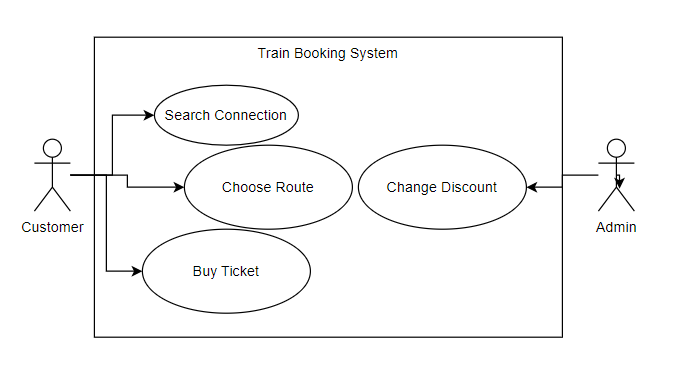
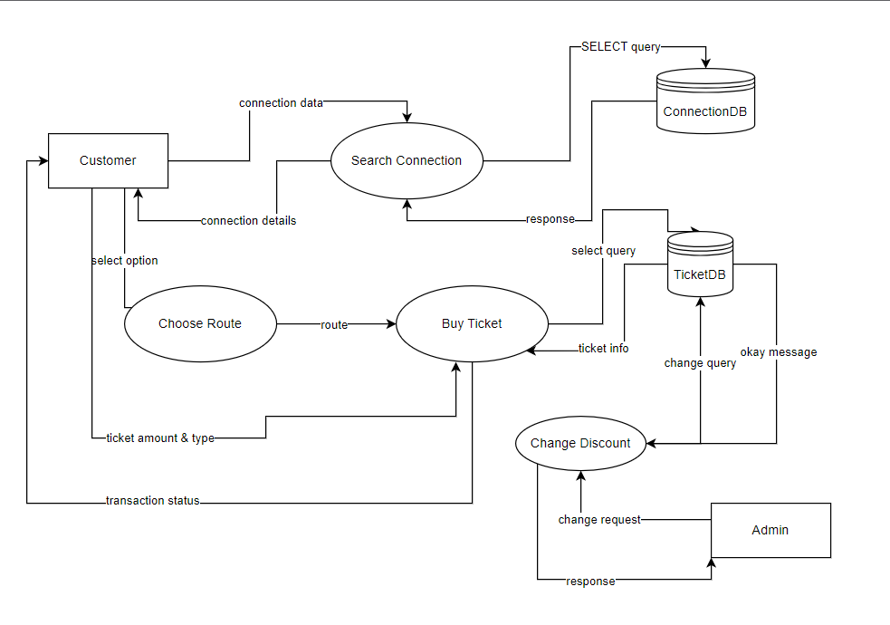
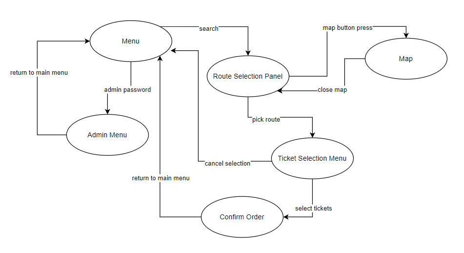
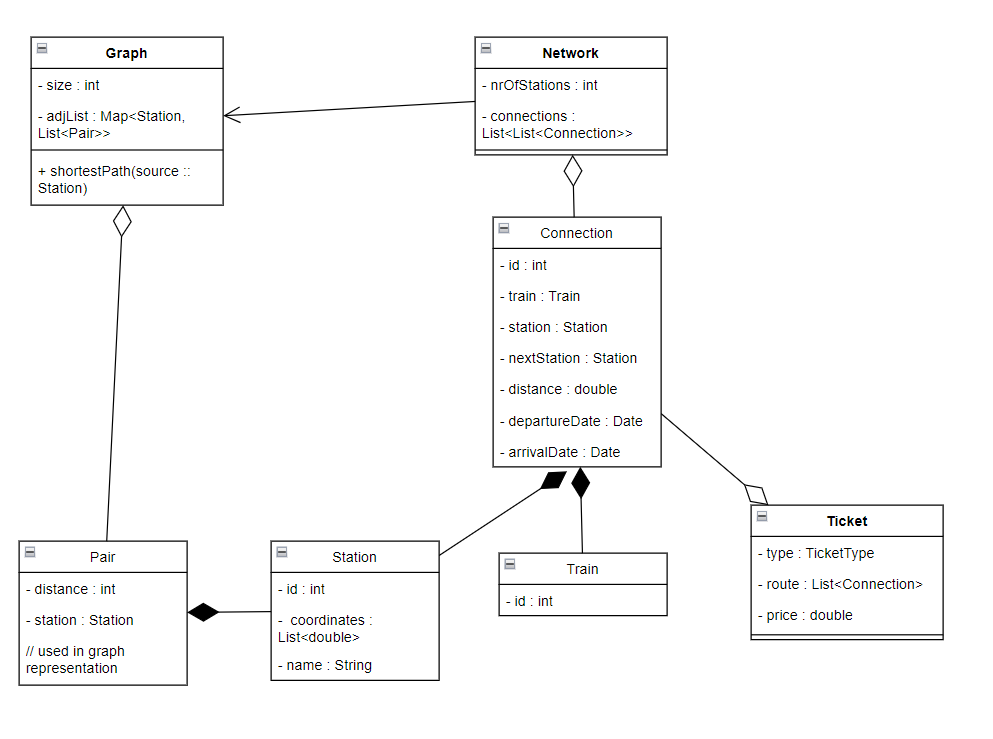
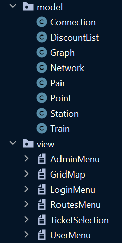

# SoftwareEngineering2023Fall

### Contents
1. Description
2. Requirements

## 1. Description
This Java app simulates a ticket webshop of a train company. The user can search train connections from one station to another and receives a selection of possible travel itineraries.

The user can choose from the routes and place an order to buy the specific ticket. They have the option to introduce a discount and the app calculates the ticket's price according to the length of the route (in distance) and the discount.

On the other hand, the admin can introduce new routes (and new stations) and new discount types.

## 2. Requirements

2.1. Use Cases

The application has 2 actors: user and admin. They can perform the following actions, shown on the __use case__ diagram:

2.2. Data-Flow

The process of using the app is illustrated on the __data-flow diagram__ above:

2.3. State Diagram

To demonstrate the transitions between different pages and states of the app, look at the following __state diagram__:

## 3. Design

At the base of the application's design stands the following class diagram.

At package level, we've used _MVC_, which stands for __Model, View, Controller__. This is a project structure principle that separates classes that represent models (shown on the class diagram, data structures in the background), views (pages of the app, used for display) and controller - a layer that connects model and view.

Due to the simplicity, there is no controller layer, that would be an important change that had to be made if the development of the app would advance.

The structure of the code is the shown in the following image, demonstrating the package structure descibed above:

#### 3.1. Model Design

In the _model_ package there are classes that represent real-life concrete objects, namely:
- Connection: containing 2 stations (departing and arriving), distance, train and date of departure and arrival.
- DiscountList: resembles an enumeration, however, each element has a name and a value between 0 and 100, representing the discount in percentage.
- Network: train network, consisting of connections.
- Point: position of a station on a map, its attributes are x and y (coordinates).
- Station: has a point and a name.
- Train: in this case has only an ID, and has no importance in this version of the app.

On the other hand, there are class for algorithms:
- Graph: contains all the functions working on the rail network. This means shortest path algorithm, conversion from network to adjacency list, adding connection, calculating distance and price between 2 stations that are not necessarily directly connected.
- Pair: value pair of Station and distance from the source station, used in the shortest path algorithm.

#### 3.2. View Design

To design the view of the app, the Java Swing library was used. The _view_ package contains all the different windows that can be accessed when using the app, and are the following:
 - LoginMenu: the first window that appears when running the app. It has two buttons: one for accessing the administrator window (which requires a password, in this case we used 'admin' as password) and one for accessing the user window (no credentials required)
 - AdminMenu: it has the option to perform different admin-level changes to the app, these being adding new connections or changing different discount amounts. It also has a button to return to the login window.
 - UserMenu: this window is for choosing the starting point and the ending point of a journey. It has two dropdown menus for the available stations, a 'Find Routes' button that opens up the routes menu, and a button for returning to the login menu.
 - RoutesMenu: this window shows you the computed path for the departure and arrival stations that were previously selected. It also contains a button for showing the map of the stations with the connections, a button for moving on to the ticket selecting window and one to go back to selecting departure and arrival stations. 
 - GridMap: This window displays, in the format of a grid, the map of the train stations, represented by the colored squares, with the connections between them, represented by the lines connecting the squares. The computed path is highlighted in the following way: The starting point is colored green, the ending point is colored red and the connections and stations in between them are blue. The window also has a button to return to the RoutesMenu.
 - TicketSelection: this window lets you choose different tickets for your selected route and displays the total that you'd have to pay for the order. You can set the number of tickets and the discount type. This window also features a button that returns you to the UserMenu window. 

## 4. Testing

#### For unit testing we have used JUnit framework for Java and written tests for the following functions:
- calculating distance
    - both coordinates increase
    - both coordinates decrease
    - one decreases one increases
- adding connection - by looking at the length of the adjacency list
    - to an empty graph
    - to a non-empty graph, a new connection
    - to a non-empty graph, a duplicate connection
- calculating price
    - varying price/km between the first 2 tests
    - adding discount for the 3rd test

## 5. Bibliography

Algorithm (Dijkstra's shortest path): https://www.geeksforgeeks.org/dijkstras-shortest-path-algorithm-in-java-using-priorityqueue/

JUnit: https://junit.org/junit5/

Java Swing: https://www.javatpoint.com/java-swing

Documentation:

https://www.markdownguide.org/basic-syntax/
https://code.visualstudio.com/docs/languages/markdown

Project on GitHub: https://github.com/pizzahunter2000/SoftwareEngineering2023Fall